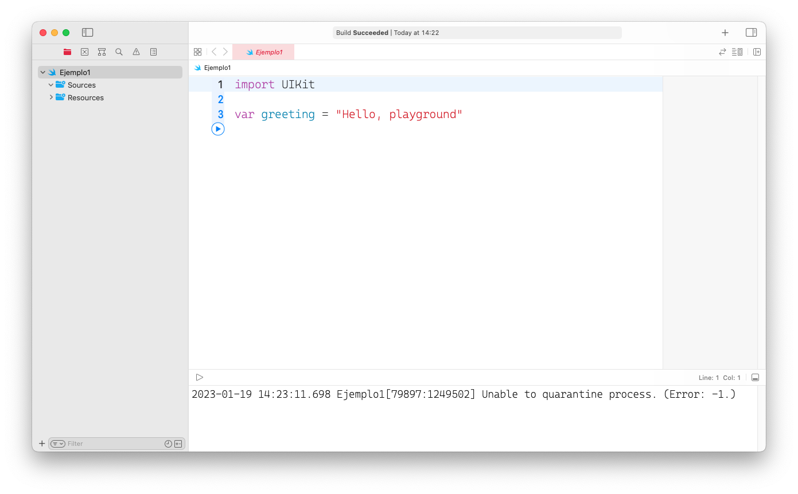

# Introducción a Swift

## Lanzamiento 
En el Worldwide Developer Conference del 2014, Apple sorprendió a los desarrolladores de iOS al lanzar 
un nuevo lenguaje de programación llamado *Swift*. Swift fue anunciado como un lenguaje de programación
rápido, moderno, seguro e interactivo. 

El lenguaje es más sencillo de aprender y posee características que hacen la programación más productiva.

Previo al anuncio de Swift, las aplicaciones de iOS eran escritas principalmente en *Objective-C*. El
lenguaje fue creado por Brad Cox y la corporación StepStone en 1980. Fue elegido por Apple como el lenguaje
principal para el desarrollo de sus aplicaciones en MacOS (antes llamado OSX) e iOS. La mayoría de los 
desarrolladores novatos de iOS consideran que Objective-C es muy difícil de aprender, uno de sus aspectos 
negativos es su sintáxis extraña. Estas razones, alejan a programadores nuevos que desean aprender a 
desarrollar aplicaciones en iOS.

El lanzamiento del lenguaje de programación Swift es quizá la respuesta de Apple a este tipo de comentarios. 
La sintáxis de Swift es más limpia y fácil de leer.

## Swift 2
En Junio del 2015, Apple anunció Swift 2 y además el lenguaje de programación se volvió de código abierto. 
Esto fue un cambio muy importante, dado que hubo desarrolladores que crearon impresionantes proyectos de 
código abierto utilizando este lenguaje. Swift puede ser usado no sólo para desarrollar aplicaciones en iOS, 
empresas como IBM que ha desarrollado un framework para la web escrito en Swift. Además, a partir de esta 
versión Swift se puede correr en Linux.

## Swift 3
Apple lanzó Swift 3 en Junio del 2016. Esta versión del lenguaje de programación se integró a XCode 8, que a 
su vez fue lanzado en Septiembre del 2016. Este es considerado uno de los lanzamientos más grandes desde el 
lanzamiento del lenguaje debido a la gran cantidad de cambios adoptados. Además las API fueron renombradas y 
se introdujeron más características. 
Todos estos cambios ayudaron a que los desarrolladores pudieran escribir código más bello. 

Sin embargo, por mucho que el lenguaje fuera mejorando, a los desarrolladores les tomó mucho esfuerzo portar 
sus proyectos desde Objective-C a Swift 3.

## Swift 4
En Junio del 2017 Apple anunció Swift 4 junto con XCode 9, que incluían muchas mejoras y nuevas 
características. Esta versión de Swift se enfocó en la retro-compatibilidad, esto significa que idealmente 
todos los proyectos desarrollados en Swift 3 + XCodde 8 podían correr en Swift 4 + XCode 9 sin cambio alguno 
en el código. Aún en el caso de que fuera necesario realizar cambios, la migración debería ser menos 
problemática que desde Swift 2.2 a 3.

## Swift 5
A finales de Marzo del 2019 Apple lanzó oficialmente Swift 5, la cual ha sido un hito para el lenguaje de 
programación. Esta versión incluye muchas características nuevas, siendo el cambio más importante la 
inclusión del paquete de compatibilidad de ejecución Swift 5 en iOS, macOS, watchOS y tvOS. Esto significa 
que Swift es ahora un lenguaje más estable y maduro.

El mismo año, 2019, el lenguaje fue actualizado a su versión 5.5 con nuevas características. Se introdujeron 
las funciones *async/await* que hacen una programación asíncrona más sencilla. 

Luego de esta recapitulación, quizá se pregunte: *¿porqué cambia tanto Swift?*, *si se actualiza 
constantemente, ¿el lenguaje se puede usar?*. Casi todos los lenguajes cambian con respecto al tiempo, 
lo mismo le ocurre a Swift. Cada año se agregan a Swift nuevas funcionalidades con la finalidad de hacerlo 
más poderoso y amigable para los desarrolladores. 

Esto ocurre también con los idiomas, por ejemplo el español. Nuevas frases y palabras son agregadas cada año. 
Todo con la finalidad de volver el idioma más útil y sencillo. Lo mismo ocurre con los lenguajes de 
programación y Swift.

A pesar de que Swift cambie constantemente, no significa que no esté listo para utilizarse. Incluso, si se 
desea desarrollar una aplicación en iOS, debería hacerlo en Swift. Esto debido a que el lenguaje se ha 
vuelto un estándar en la industria para el desarrollo de aplicaciones en iOS y además el lenguaje cuenta con 
soporte vigente de Apple. 

Empresas como Linkedin, Duolingo y Mozilla han escrito sus aplicaciones completamente en Swift desde sus 
primeras versiones.

Desde la versión 4 de Swift el lenguaje es lo suficientemente estable y definitivamente listo para su uso en 
un entorno profesional o empresarial.

## Swift 5.7.3
La última versión de Swift al momento de escribir esto es la 5.7.3 y se encuentra en desarrollo la versión 
5.8. Si desea más información acerca de las características incluidas en esta última versión, puede 
consultarlo en la [página oficial de lanzamientos.](https://www.swift.org/download/)


# Swift vs Objective-C
Diferencias entre Swift y Objective-C.

Veamos un ejemplo puntual de la diferencia que hay entre Objective-C y Swift.
Este código `Objective-C` imprime un mensaje.
```Objective-c
const int count = 10;
double price = 23.55;

NSString *firstMessage = @"Swift is awesome. ";
NSString *secondMessage = @"What do you think?";
NSString *message = [NSString stringWithFormat:@"%@%@", firstMessage, secondMessage];

NSLog(@"%@", message);
```

Por otro lado, este código en `Swift` imprime un mensaje.
```swift
let count = 10
var price = 23.55

let firstMessage = "Swift is awesome. "
let secondMessage = "What do you think?"
var message = firstMessage + secondMessage

print(message)
```

El primer bloque fue escrito en *Objective-C* mietras que el segundo fue escrito en *Swift*. ¿Qué lenguaje 
prefiere?, ¿porqué?. Es más que natural que haya elegido *Swift*, particularmente si usted se encuentra 
frustrado con la sintáxis de *Objective-C*. 

En Swift, el código es más claro y legible, no hay símbolos @  y  *puntos-y-coma* en cada línea. En ambos 
códigos, lo que se realiza es la concatenación de dos cadenas.

El siguiente código es fácilmente entendible:

```swift
var message = firstMessage + secondMessage
```
mientras que el siguiente código no es tan claro pero realiza la misma acción:
```Objective-c
NSString *message = [NSString stringWithFormat:@"%@%@", firstMessage, secondMessage];
```

## Primeros pasos en Swift
Antes de comenzar con XCode, es recomendable conocer el lenguaje de programación Swift. El objetivo
es distinguir la diferencia entre Swift y XCode, uno es un lenguaje de programación y el
segundo es un IDE para dicho lenguaje.

### Su primer programa en Swift
Utilice algún editor de texto de su preferencia, escriba las siguientes líneas y guarde el archivo
con el nombre ´holaMundo.swift´.

```swift
print("Hola mundo")
```

Para compilar y correr el programa es necesario abrir una terminal y ejecutar el comando:

```zsh
$ swift holaMundo.swift
```

Si se desea compilar y correr por separado, se debe utilizar el comando `swiftc`. Este comando
compila el código y genera un archivo ejecutable. Este archivo ejecutable tiene el mismo nombre
que el archivo que contiene el código y los permisos de ejecución necesarios. 

Para ejecutar el archivo resultante se debe hacer como cualquier ejecutable en una termial UNIX.

```zsh
$ swiftc holaMundo.swift
$ ./holaMundo
```

Si se ejecuta en la termina el comando `swift` sin argumentos se abrirá el intérprete interactivo
de Swift. 

## Swift en Playgrounds de XCode
Los *Playgrounds* de XCdode son un ambiente de desarrollo interactivo que permiten a los desarrolladores 
experimentar con el lenguaje y además pueden mostrar los resultados del código en tiempo real. 

Un Playgrouind es un tipo especial de archivo de XCdode, se puede crear desde el menú 
*File > New > Playground*. Esto debe abrir una plantilla nueva para el playground. Es posible elegir entre 
aplicaciones iOS o macOS, dado que el enfoque del curso es en aplicaciones móviles se debe elegir iOS.



El panel central de la pantalla se encuentra el editor donde se puede escribir el código. Si se desea 
probar el códio y observar su funcionamiento basta con presionar el botón de *Play*. El playground 
interpretará inmediatamente el código, únicamente el código que se encuentra desde el inicio hasta el 
punto donde se encuentre dicho botón, y el resultado se mostrará en el panel derecho. 

Por defecto, playground incluye dos líneas de código y el contenido de la variable str aparecerá en el 
panel de la derecha.

```swift
import UIKit

var greeting = "Hello, playground"
```

###### [Anterior](diu.html) | [Inicio](index.html) | [Siguiente](variables.html) 
